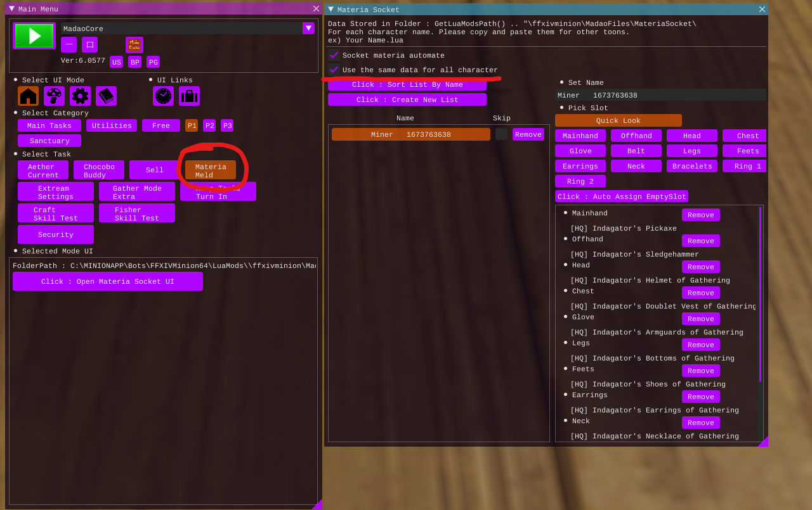

# 6.3 Materia melds

## Sources
[Teamcraft gathering melding guide (6.3)](https://guides.ffxivteamcraft.com/guide/gathering-melding-guide)  
[Teamcraft crafting melding guide (6.3)](https://guides.ffxivteamcraft.com/guide/crafting-melding-guide)  


## Materia quicklist
Crafter
```
1x	Craftsman's Cunning Materia I
2x	Craftsman's Cunning Materia II
1x	Craftsman's Cunning Materia III
1x	Craftsman's Cunning Materia IV
6x	Craftsman's Cunning Materia V
18x	Craftsman's Cunning Materia VII 
5x 	Craftsman's Cunning Materia IX 
2x	Craftsman's Competence Materia IX
7x	Craftsman's Competence Materia X
16x	Craftsman's Command Materia IX
22x	Craftsman's Command Materia X
```

Gatherer
```
14x	Gatherer's Grasp Materia IX
1x	Gatherer's Grasp Materia X
1x	Gatherer's Guerdon Materia VII
32x 	Gatherer's Guerdon Materia IX
15x	Gatherer's Guerdon Materia X
1x	Gatherer's Guile Materia IV
8x	Gatherer's Guile Materia IX
13x	Gatherer's Guile Materia X
```

## Progress
- [x] Gatherer base melds for all classes.
- [x] Gatherer weapon melds.
- [x] Crafting base melds for all classes.
- [x] Crafting weapon melds.


## Installation
1. Copy `Common Profile` to `C:\MINIONAPP\Bots\FFXIVMinion64\LuaMods\ffxivminion\MadaoFiles\MateriaSocket\`.
2. Set ingame to use sama data on all characters.
3. Press start.


--


